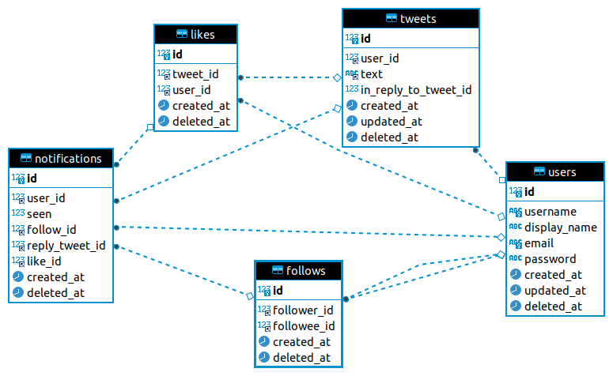

Imitating twitter backend API using Gin, GORM, and MySQL, just for learning purpose. 

## Features
- Create, deactivate, and reactivate account.
- Create tweets. Search a tweet with a keyword.
- Reply to a tweet. See replies to a tweet.
- Like and unlike a tweet. See users who like a tweet.
- Follow and unfollow other users. See other users followers and followings.
- See tweets from people you follow (timeline).
- See notifications when other users followed you, replied to your tweet, and liked your tweet.

## Models


## Getting Started
### Using Local GO Installation
1. Run `go mod download` to install the dependencies.
1. Create a `.env` file, set your env variables there, see the example in `.env.example`.
1. Run `go run main.go` to start the service.
### Using Docker Compose
1. Run `docker-compose build`
1. Run `docker-compose up`

### Documentation
After running the server, you can checkout the docs at `/swagger/index.html`

### Tests
```
go test -v ./tests/
```
